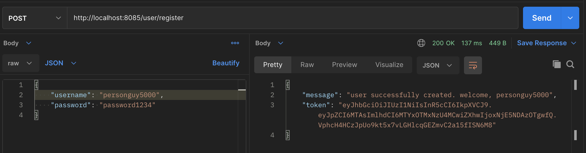
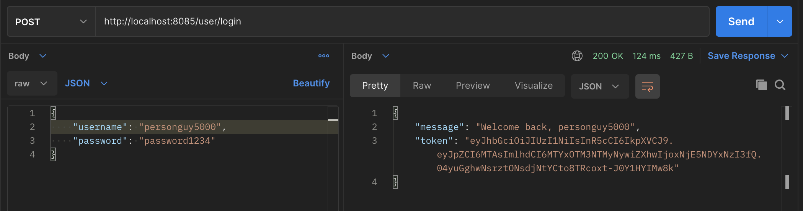
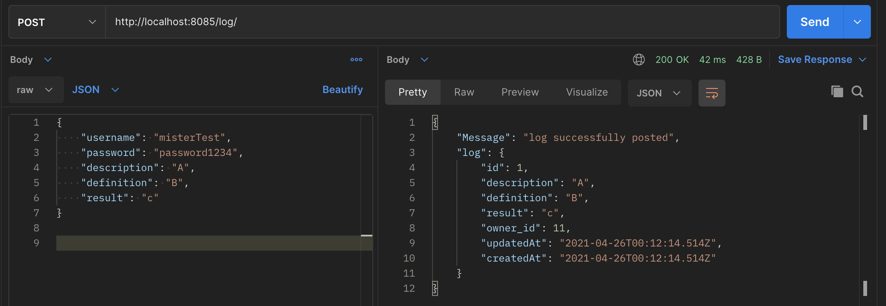
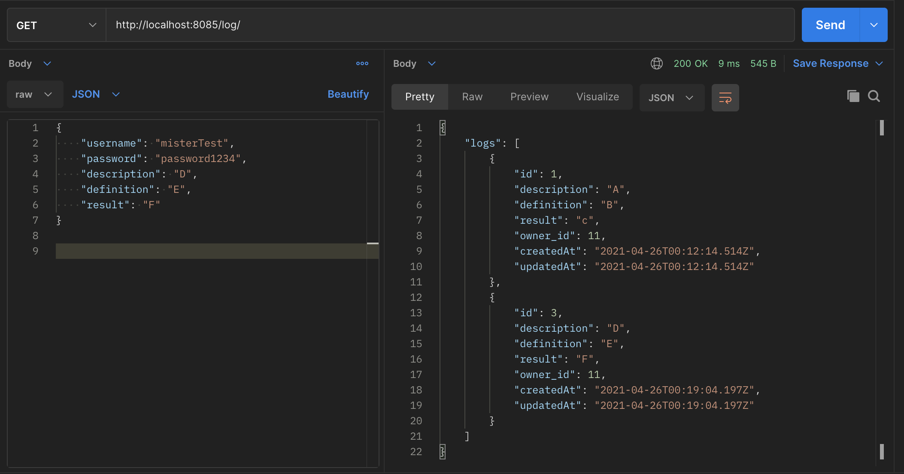
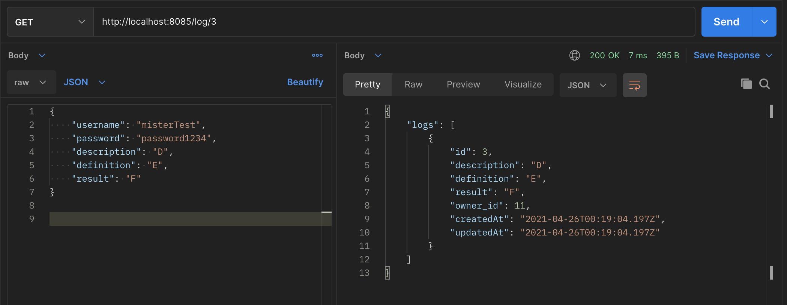
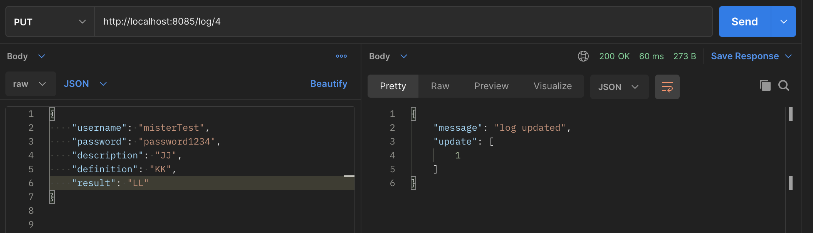
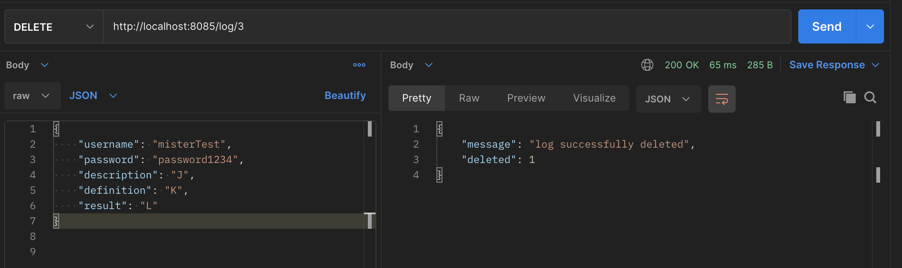

Workout Log

Endpoints:

/user/register  POST
adds a new user to the database

/user/login     POST
revalidate an existing user

/log/           POST
adds a new log to the database, owned by posting user

/log/           GET
view all posts by current user

/log/:id        GET
view logs with stated Id

/log/:id        PUT
Updates stated log entry if owned by the user

/log/:id        DELETE
Deletes stated log entry, if owned by the user

